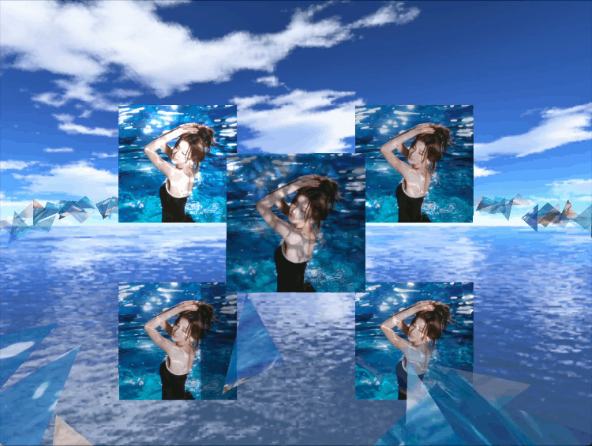

# OpenGL Rendering Demo

本项目是一个 **基于 C++/OpenGL 的轻量级实时渲染框架**，实现了现代图形引擎常见的渲染管线与特效。  
采用了 **延迟渲染（Deferred）与前向渲染（Forward）相结合的混合架构**，在多光源下高效的不透明物体渲染，同时保证透明、粒子、发光对象等效果的正确性。

原视频在代码文件中

---

## 核心特性

### 渲染架构
- **Hybrid Pipeline**:  
  - **Deferred Shading**（延迟渲染）用于不透明几何体（G-Buffer: Position, Normal, Albedo, Specular 等）；  
  - **Forward Rendering**（前向渲染）用于透明物体、粒子系统和发光特效，保证正确的混合与后期效果。  

- **SSAO**: 基于核采样 + 噪声旋转的屏幕空间环境光遮蔽，并通过模糊滤波提升接触阴影质量。  

- **Shadow Mapping**: 光源深度贴图生成 + Bias 校正，支持场景物体、碎片、粒子的阴影投射。  

- **Post-Processing**:  
  - **Bloom/Glow**（亮度提取 + 高斯模糊 + 合成）  
  - **HDR 渲染与色调映射（Tone Mapping）**
  - **抗锯齿MXAA**

### 场景与特效
- **程序化几何 – 行星带碎片**  
  - 三角碎片随机分布在圆环轨道上，带有角速度、自旋、Y 轴扰动与透明度抖动；  
  - 具备 **随机滤镜色彩**（橙/黄/蓝），并可在特定时刻按边顺序点亮，模拟光带效果。  

- **粒子系统**  
  - 生命周期控制（5s）与系统周期（8s）统一调度：0–5s 发射，5–8s 停止发射并逐渐清场；  
  - 渐变颜色可调速、尺寸扰动、平面偏置方向发射；  
  - 粒子采用加色混合，正确进入 Bloom 管线。  

- **动画系统**  
  - 基于时间片的参数控制，支持物体位置插值与自旋动画；  
  - 用于驱动四周图片方块、碎片特效、粒子窗口化发射。  

- **模型加载**  
  - 基于 Assimp 与 stb_image，支持贴图加载（漫反射、法线贴图、镜面/金属度）。  

- **相机系统**  
  - 自由视角相机，支持 WASD + 鼠标交互。  

---

### 项目结构
- application/   # 程序入口与主循环
- assets/        # Shaders / Textures / Models / Skybox
- camera/        # 相机与控制逻辑
- core/          # 渲染核心封装（Shader/Texture/Geometry）
- particle/      # 粒子系统实现
- renderer/      # GBuffer / SSAO / Lighting / Post-Processing
- scene/         # 场景构建与动画逻辑
- utils/         # 数学工具、随机数、通用方法
- main.cpp       # 程序入口
- CMakeLists.txt
